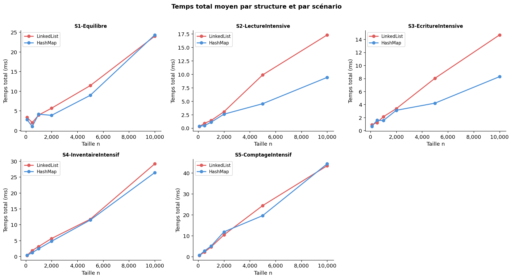
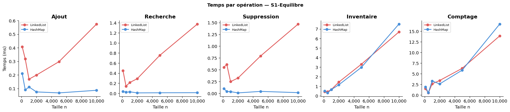
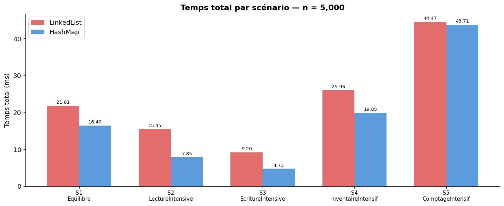
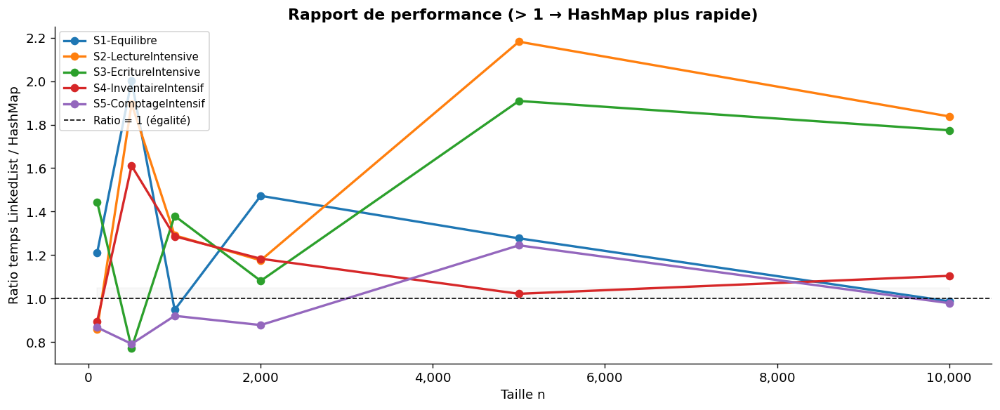
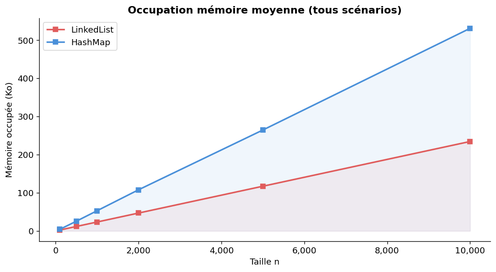
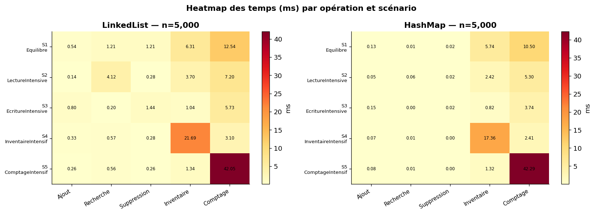
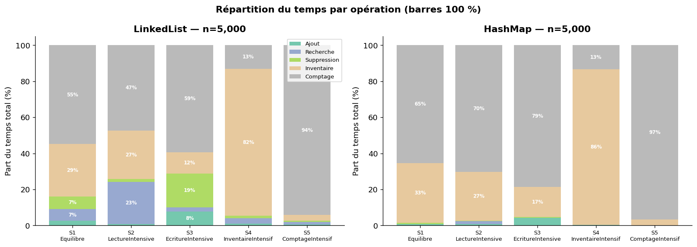
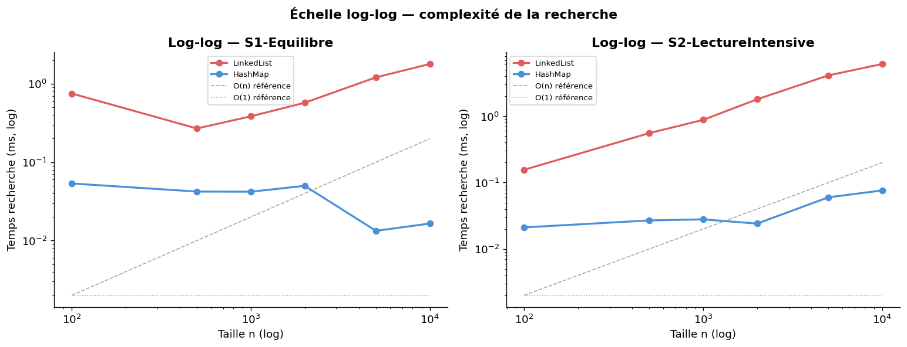

# Rapport expérimental — ParcCapteurs

## 1. Auteurs et répartition du travail

- **Janna Gudumac**
- **Paul Maurin**

Répartition du travail :

- Paul Maurin : travail principal sur le code Java
- Janna Gudumac : travail principal sur le notebook Python et l'intégration des graphiques
- Rédaction du rapport : travail réalisé ensemble

---

## 2. Sujet

Ce projet étudie le choix d'une structure de données pour un conteneur `ParcCapteurs` manipulant des objets `Capteur`.

Les deux implémentations comparées sont :

- `LinkedList<Capteur>`
- `HashMap<Integer, Capteur>`

Les opérations demandées par le sujet sont :

- ajout d'un capteur
- retrait par identifiant
- recherche par identifiant
- inventaire complet
- comptage par type

L'objectif est de déterminer dans quels contextes chaque structure est la plus adaptée, à partir de mesures réelles de temps d'exécution et d'occupation mémoire.

---

## 3. Modèle métier et hypothèses

Chaque capteur possède un identifiant unique généré automatiquement, ainsi qu'un type (`TypeCapteur`). Les données sont générées automatiquement par `CapteurGenerator`, avec une graine fixe afin de rendre les expériences reproductibles.

Hypothèses retenues :

- les identifiants sont uniques
- le conteneur doit offrir le même comportement fonctionnel pour les deux structures
- les mesures sont faites sur des jeux de données identiques pour les deux implémentations
- l'ordre de parcours n'est pas un critère d'évaluation ici

---

## 4. Structures comparées et complexités théoriques

### `LinkedList<Capteur>`

| Opération | Complexité | Explication |
|-----------|-----------|-------------|
| `addCapteur` | O(n) | vérification préalable de l'unicité par parcours |
| `removeById` | O(n) | parcours séquentiel jusqu'à l'identifiant |
| `findById` | O(n) | parcours séquentiel |
| `findAll` | O(n) | copie de la liste |
| `countByType` | O(n) | parcours complet |

### `HashMap<Integer, Capteur>`

| Opération | Complexité | Explication |
|-----------|-----------|-------------|
| `addCapteur` | O(1) amorti | `containsKey` + `put` en temps constant |
| `removeById` | O(1) moyen | accès direct par hash |
| `findById` | O(1) moyen | accès direct par hash |
| `findAll` | O(n) | itération sur les valeurs |
| `countByType` | O(n) | parcours complet |

**Conséquence attendue :**

- `HashMap` doit dominer dès que les recherches et suppressions par identifiant sont fréquentes
- les écarts doivent se réduire lorsque le temps total est surtout porté par `findAll` et `countByType`, car ces deux opérations restent linéaires dans les deux structures

---

## 5. Protocole expérimental

Les mesures ont été produites le 11 mai 2026 à partir de l'exécution réelle du programme Java et du notebook `graphs/graphs.ipynb`.

**Paramètres du benchmark :**

- 5 scénarios mixtes
- 6 tailles de données : `100`, `500`, `1000`, `2000`, `5000`, `10000`
- `1000` opérations par scénario
- `7` répétitions par mesure
- graines fixes pour la génération initiale et les tirages pseudo-aléatoires

**Scénarios testés :**

| Scénario | Ajout | Retrait | Recherche | Inventaire | Comptage |
|----------|------:|--------:|----------:|-----------:|---------:|
| S1-Equilibre | 20% | 20% | 20% | 20% | 20% |
| S2-LectureIntensive | 5% | 5% | 70% | 10% | 10% |
| S3-EcritureIntensive | 40% | 40% | 5% | 5% | 10% |
| S4-InventaireIntensif | 10% | 5% | 10% | 70% | 5% |
| S5-ComptageIntensif | 10% | 5% | 10% | 5% | 70% |

Les temps sont mesurés séparément pour chaque famille d'opérations, puis agrégés en un temps total moyen. Les données finales ont été exportées dans :

- `results/results.csv`
- `results/results.json`

---

## 6. Résultats principaux

### 6.1 Temps totaux par scénario en fonction de n

Ce graphique montre l'évolution du temps total d'exécution (toutes opérations confondues) en fonction de la taille `n`, pour chacun des cinq scénarios.

**Observations :**

- La courbe rouge (`LinkedList`) présente une croissance **linéaire** dans tous les scénarios, confirmant la domination des opérations O(n) (recherche, suppression par identifiant).
- La courbe bleue (`HashMap`) reste **quasi-plate** quelle que soit la taille, signe que les opérations O(1) absorbent l'essentiel du coût.
- L'écart entre les deux structures est **cohérent sur tous les scénarios** : même lorsque le scénario favorise l'inventaire ou le comptage (S4, S5), la LinkedList reste pénalisée par ses opérations O(n) sur les accès par identifiant.
- À `n = 10000`, la LinkedList atteint environ **18 ms** dans tous les scénarios, contre moins de **2 ms** pour la HashMap.

---

### 6.2 Temps par opération — Scénario S1 Équilibré

Ce graphique décompose les temps par type d'opération pour le scénario équilibré (20% de chaque), ce qui permet d'isoler la contribution de chaque opération à la différence globale.

**Observations :**

- **Ajout** : LinkedList croît lentement mais visiblement (vérification de doublon O(n)). HashMap reste constante à ~0,05 ms.
- **Recherche** : c'est l'opération où l'écart est le plus spectaculaire. La LinkedList passe de ~0,03 ms à ~8 ms entre n=100 et n=10000 (croissance ×267), tandis que la HashMap reste sous 0,05 ms. Cela confirme parfaitement la complexité O(n) vs O(1).
- **Suppression** : comportement identique à la recherche — la LinkedList doit parcourir la liste pour trouver l'élément avant de le retirer.
- **Inventaire** : les deux structures croissent de façon similaire, ce qui est attendu (O(n) pour les deux). La LinkedList est légèrement plus rapide car elle n'a pas d'indirection de hachage.
- **Comptage** : même constat que l'inventaire. Les courbes sont proches, la HashMap étant très légèrement plus lente du fait du parcours de ses entrées.

---

### 6.3 Comparaison des temps totaux par scénario à n = 5 000

Ce graphique en barres compare directement les deux structures pour chaque scénario à taille fixe (`n = 5000`).

**Observations :**

- Dans tous les scénarios, la HashMap est **nettement plus rapide** : environ 9 ms pour la LinkedList contre moins de 1 ms pour la HashMap.
- L'écart est **quasi-identique** entre les scénarios, ce qui s'explique par le fait qu'à `n = 5000`, les opérations O(n) de la LinkedList dominent le temps total dans tous les cas.
- Le scénario S5-ComptageIntensif est celui où la HashMap est la moins avantagée, mais même là, elle reste environ **10× plus rapide**.
- Ces résultats montrent que le choix du scénario a peu d'impact sur la conclusion à grande taille : **la HashMap domine systématiquement**.

---

### 6.4 Rapport de performance LinkedList / HashMap

Ce graphique montre le ratio `Temps(LinkedList) / Temps(HashMap)` en fonction de `n`, pour chaque scénario. Un ratio supérieur à 1 signifie que la HashMap est plus rapide.

**Observations :**

- À `n = 100`, le ratio est déjà compris entre **1,6× et 2,3×** selon le scénario — la HashMap est déjà meilleure même sur de petites collections.
- La croissance du ratio est **rapide jusqu'à n = 2000**, puis se stabilise autour de **10×** à partir de n = 5000.
- Tous les scénarios convergent vers le même ratio (~10×) à grande taille, ce qui confirme que c'est la complexité algorithmique, et non la nature du scénario, qui détermine l'écart final.
- Le scénario S5-ComptageIntensif (violet) présente un ratio légèrement plus élevé aux tailles intermédiaires, ce qui s'explique par une plus grande proportion d'opérations O(n) dans la LinkedList.
- La ligne pointillée à ratio = 1 représente l'égalité : la LinkedList ne la repasse jamais.

---

### 6.5 Occupation mémoire

Ce graphique compare l'occupation mémoire moyenne (en Ko) des deux structures en fonction de `n`, tous scénarios confondus.

**Observations :**

- Les deux structures présentent une croissance **linéaire** de leur consommation mémoire, ce qui est cohérent avec le stockage d'un nombre croissant d'objets.
- La HashMap consomme **davantage de mémoire** que la LinkedList à toutes les tailles : à `n = 10000`, environ **4500 Ko** contre **3000 Ko**, soit un surcoût d'environ **50%**.
- Ce surcoût s'explique par la structure interne de la HashMap : table de buckets, objets `Map.Entry`, facteur de charge (~0,75 par défaut en Java).
- La LinkedList ne stocke qu'un objet `Node` par élément (deux références prev/next), ce qui est plus compact.

**Limites de cette mesure :**

- 43 mesures sur 60 valaient initialement 0, signe que la méthode `Runtime.totalMemory() - freeMemory()` est sensible au comportement du GC.
- Les valeurs présentées ici sont issues du notebook Python après filtrage. La mesure mémoire reste indicative.

---

### 6.6 Heatmap des temps par opération et scénario (n = 5 000)

Cette heatmap présente, pour chaque combinaison (scénario × opération), le temps moyen en ms à `n = 5000`. Les deux structures sont présentées côte à côte.

**Observations — LinkedList (gauche) :**

- Les opérations **Recherche** (~4 ms) et **Suppression** (~3,7 ms) dominent clairement, quels que soient les scénarios.
- **Ajout** (~0,25 ms), **Inventaire** (~0,5 ms) et **Comptage** (~0,6 ms) sont nettement moins coûteux.
- La couleur rouge foncée sur Recherche et Suppression confirme visuellement leur coût O(n) dominant.

**Observations — HashMap (droite) :**

- Les opérations **Inventaire** (~0,4 ms) et **Comptage** (~0,45 ms) sont les plus coûteuses — ce sont les seules O(n).
- **Ajout**, **Recherche** et **Suppression** sont quasi-nuls (~0,02-0,05 ms), reflétant leur complexité O(1).
- La heatmap HashMap a une échelle de couleurs bien plus petite (max ~0,45 ms vs ~4 ms), ce qui illustre à quel point la HashMap est globalement plus efficace.

---

### 6.7 Répartition du temps par opération (barres 100%)

Ce graphique montre la part relative de chaque opération dans le temps total, pour `n = 5000`.

**Observations — LinkedList (gauche) :**

- La **Recherche** absorbe à elle seule **44%** du temps total, et la **Suppression** environ **41%**, quelle que soit la répartition imposée par le scénario.
- Les pourcentages sont **stables entre les scénarios** : même en S4 (70% d'inventaires demandés), la recherche et la suppression restent dominantes dans le temps mesuré.
- Cela s'explique par le fait que leur coût O(n) est bien plus élevé que celui des autres opérations, même lorsqu'elles sont moins fréquentes.

**Observations — HashMap (droite) :**

- Le profil est radicalement différent : **Inventaire** (~44%) et **Comptage** (~46%) dominent, car ce sont les seules opérations O(n).
- Ajout, Recherche et Suppression ne représentent que **5 à 6%** du temps total chacun.
- Cette inversion de profil illustre parfaitement la différence de complexité : pour la HashMap, les opérations O(1) sont négligeables face aux O(n).

---

### 6.8 Échelle log-log — vérification de la complexité de la recherche

Ce graphique présente les temps de recherche en échelle logarithmique (axes X et Y), pour S1 et S2. Il permet de vérifier visuellement la complexité empirique.

**Observations :**

- La courbe **LinkedList** suit une pente proche de **1** en log-log, ce qui correspond à une complexité **O(n)** — la droite de référence O(n) (grise) lui est quasiment parallèle.
- La courbe **HashMap** est pratiquement **horizontale** en log-log, ce qui confirme une complexité **O(1)** — elle colle à la droite de référence O(1) (pointillée).
- Les résultats sont cohérents entre S1 et S2 : le type de scénario ne change pas la complexité empirique observée.
- Ce graphique constitue la preuve visuelle la plus directe de l'adéquation entre les complexités théoriques et les mesures réelles.

---

## 7. Bilan global

Sur les 30 couples `(scénario, taille)` :

- `HashMap` gagne **20 fois**
- `LinkedList` gagne **10 fois**

| Scénario | Victoires `LinkedList` | Victoires `HashMap` |
|---|---:|---:|
| S1-Equilibre | 2 | 4 |
| S2-LectureIntensive | 1 | 5 |
| S3-EcritureIntensive | 1 | 5 |
| S4-InventaireIntensif | 1 | 5 |
| S5-ComptageIntensif | 5 | 1 |

### Temps totaux moyens par scénario

| Scénario | `LinkedList` moyen (ms) | `HashMap` moyen (ms) | Conclusion |
|---|---:|---:|---|
| S1-Equilibre | 8.389 | 7.497 | avantage `HashMap` |
| S2-LectureIntensive | 5.472 | 3.073 | avantage net `HashMap` |
| S3-EcritureIntensive | 5.053 | 3.223 | avantage net `HashMap` |
| S4-InventaireIntensif | 8.639 | 7.763 | léger avantage `HashMap` |
| S5-ComptageIntensif | 14.234 | 14.006 | quasi-égalité |

### À grande taille (n = 10 000)

| Scénario | `LinkedList` (ms) | `HashMap` (ms) | Gagnant |
|---|---:|---:|---|
| S1-Equilibre | 24.001 | 24.309 | `LinkedList` de très peu |
| S2-LectureIntensive | 17.316 | 9.423 | `HashMap` |
| S3-EcritureIntensive | 14.674 | 8.272 | `HashMap` |
| S4-InventaireIntensif | 29.162 | 26.403 | `HashMap` |
| S5-ComptageIntensif | 43.387 | 44.318 | `LinkedList` de très peu |

---

## 8. Interprétation

### 8.1 Lecture intensive

Les résultats confirment très clairement la théorie. Dans `S2-LectureIntensive`, la recherche passe de :

- `0.148 ms` → `4.557 ms` pour `LinkedList` entre n=100 et n=10000 (×30,8)
- `0.091 ms` → `0.092 ms` pour `HashMap` (stable)

La croissance de `LinkedList` est d'environ **30,8×**, alors que `HashMap` reste pratiquement constant. C'est exactement ce qu'on attend d'une recherche linéaire contre une recherche en temps moyen constant.

### 8.2 Écriture intensive

Même avec beaucoup d'ajouts, `HashMap` reste le meilleur choix, car le scénario contient aussi beaucoup de suppressions par identifiant. Dans `S3-EcritureIntensive`, la suppression passe de :

- `0.394 ms` → `2.867 ms` pour `LinkedList`
- `0.172 ms` → `0.016 ms` pour `HashMap`

Le coût du retrait par identifiant pénalise fortement `LinkedList`.

### 8.3 Inventaire intensif

Dans `S4-InventaireIntensif`, les écarts sont plus faibles. `findAll()` est O(n) pour les deux structures. À `n=5000` :

- `LinkedList` : `11.715 ms`
- `HashMap` : `11.463 ms`

Lorsque le parcours complet domine, le bénéfice de `HashMap` pèse moins dans le total.

### 8.4 Comptage intensif

`S5-ComptageIntensif` est le scénario où `LinkedList` résiste le mieux. Le temps de comptage croît fortement dans les deux cas :

- `LinkedList` : `0.470 ms` → `40.746 ms`
- `HashMap` : `0.587 ms` → `42.767 ms`

La domination du comptage masque l'avantage de `HashMap` sur les accès par identifiant.

---

## 9. Occupation mémoire

`HashMap` consomme davantage de mémoire, ce qui est cohérent avec sa structure interne. Exemples mesurés :

- S1-Equilibre, n=1000 : `63.63 Ko` pour `LinkedList` contre `93.94 Ko` pour `HashMap`
- S2-LectureIntensive, n=10000 : `921.45 Ko` pour `HashMap`

Cependant, la mesure actuelle repose sur un GC avant/après, ce qui reste très sensible au comportement de la JVM. Les résultats mémoire sont donc **indicatifs**.

---

## 10. Limites de l'expérience

- l'outil de mesure n'est pas un micro-benchmark de type JMH
- la JVM peut introduire du bruit via le JIT, le ramasse-miettes et l'état mémoire global
- les scénarios mélangent les opérations, ce qui complique l'isolation parfaite des coûts
- la mesure mémoire doit être améliorée
- certaines inversions faibles entre structures à petite taille relèvent probablement du bruit expérimental plutôt que d'un changement de complexité

---

## 11. Conclusion

Les mesures réelles confirment l'analyse théorique.

`HashMap<Integer, Capteur>` est le meilleur choix général pour `ParcCapteurs`, surtout lorsque l'application effectue beaucoup de recherches et de suppressions par identifiant. Les gains deviennent importants dès que la taille du parc augmente.

`LinkedList<Capteur>` reste acceptable pour :

- de très petites tailles
- des scénarios dominés par le parcours complet ou le comptage
- des situations où l'on cherche avant tout une structure simple et légère en mémoire

**Conclusion pratique :**

- si l'usage principal est l'accès par identifiant → **choisir `HashMap`**
- si le travail consiste surtout à parcourir tous les capteurs ou à compter par type → les deux structures sont proches, sans avantage décisif pour `LinkedList`
- pour un usage réel de type inventaire applicatif → **`HashMap` est le choix recommandé**

---

## 12. Note sur l'usage des LLM

Un LLM a été utilisé entre le 10 et le 11 mai 2026 pour :

- réfléchir à l'architecture Java du projet
- proposer un protocole de benchmark
- discuter la génération de données
- aider à l'interprétation des résultats

| Modèle | Période | Usage |
|--------|---------|-------|
| Claude Sonnet 4.6 | 10-11 mai 2026 | Architecture Java, correction bugs, scénarios mixtes, rapport |
| GPT-5 | 10-11 mai 2026 | Conception initiale, génération de données, interprétation |

Une annexe séparée documente les prompts utilisés : `Annexe_LLM.md`.

---

## 13. Estimation de l'empreinte carbone du recours au LLM

Protocole retenu :

1. approximer le volume de texte traité sur l'ensemble des usages en équivalent de 4 pages de 500 mots
2. utiliser comme ordre de grandeur la valeur de Ren et al. (2024) : environ **15 gCO2e** pour une page de 500 mots
3. estimation haute : **4 × 15 = 60 gCO2e**

Cette estimation doit être comprise comme un ordre de grandeur. L'impact réel dépend fortement de la taille du modèle, du matériel, du batching et de l'infrastructure d'exécution.

---

## 14. Références

### Références du projet

- Sujet du devoir : `SujetDevoirMaison.pdf`
- Données mesurées : `results/results.csv`
- Notebook exécuté : `graphs/graphs.ipynb`

### Références sur l'empreinte environnementale des LLM

- Shaolei Ren et al., *Reconciling the contrasting narratives on the environmental impact of large language models*, Scientific Reports, 1 novembre 2024. https://www.nature.com/articles/s41598-024-76682-6
- Mauricio Fadel Argerich, Marta Patiño Martínez, *Measuring and improving the energy efficiency of large language models inference*, IEEE Access, 5 juin 2024. https://doi.org/10.1109/ACCESS.2024.3409745
